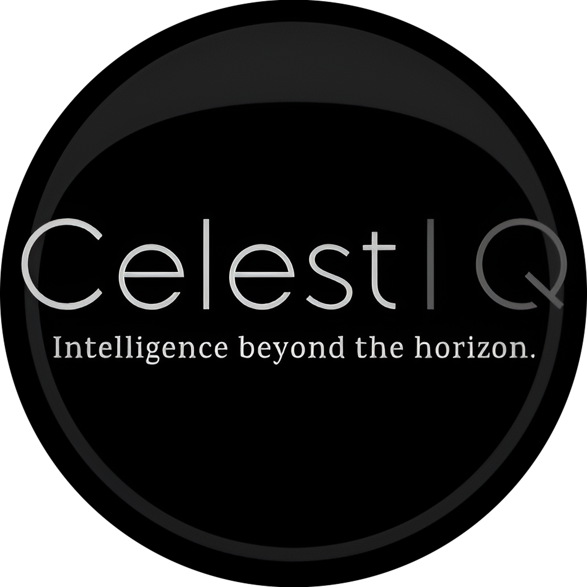

CelestIQ - Intelligence beyond the Horizon is a React-based project designed to replicate the functionality of the Google Gemini AI chatbot, leveraging the Google Gemini API for enhanced conversational interactions.

The application aims to provide a seamless and engaging conversational experience by integrating the Google Gemini API into its core functionalities. It allows users to engage in meaningful discussions on various topics while benefiting from the cutting-edge technology behind Google Gemini.




Vercel: https://celest-iq.vercel.app/

## Table of Contents

- [Introduction](#introduction)
- [Features](#features)
    - [Core Features](#core-features)
    - [Additional Features](#additional-features)
    - [Potential Enhancements](#potential-enhancements)
- [Installation](#installation)
- [Usage](#usage)
- [Acknowledgment](#acknowledgment)

## Introduction
CelestIQ - Intelligence beyond the Horizon is a web application built using React that emulates the Google Gemini AI chatbot. The application offers a user-friendly interface to interact with the Gemini model, enabling users to ask questions and receive informative, conversational responses.

## Features

### Core Features

- **Interactive Chat Interface:** A sleek and responsive chat interface to facilitate seamless interaction with the Gemini model.
- **Simulated Typing Effect:** Mimics natural typing to enhance the conversational experience.
- **Google Gemini API Integration:** Leverages the Google Gemini API to generate accurate and informative responses.

### Additional Features

- **React Framework:** Utilizes the power of React's component-based architecture for efficient and maintainable code.
- **CSS Styling:** Custom CSS for an aesthetically pleasing and user-friendly interface design.

### Potential Enhancements

- **Conversation History:** Logs previous interactions for easy reference and continuity in conversations.
- **Rich UI Elements:** Adds advanced UI elements such as emojis, text formatting options, and user avatars to enrich the chat experience.
- **Extended Functionality:** Plans to incorporate features like image search, language translation, and more to enhance the chatbot’s capabilities.

## Installation

1. Navigate to the project directory:

   ```bash
   cd CelestIQ - Intelligence beyond the Horizon
   ```

2. Install dependencies:

   ```bash
   npm install
   ```

3. Create a `.env.local` file in the root of the project and add your Google Gemini API key:

   ```plaintext
   GEMINI_API_KEY="YOUR_GEMINI_API_KEY"
   ```

4. Start the development server:

   ```bash
   vite
   ```

## Usage

After installation, open your browser and navigate to `http://localhost:5173/` to access the CelestIQ - Intelligence beyond the Horizon application. You can start interacting with the CelestIQ model through the chat interface provided in the application.

## Acknowledgment

Special thanks to **[GreatStack](https://www.youtube.com/@GreatStackDev)** for his [Gemini Clone tutorial](https://youtu.be/0yboGn8errU?feature=shared) that served as a valuable reference for this project.

It's also essential to acknowledge **Google** for providing their free Gemini APIs and **vercel** for providing their free-of-cost hosting plans, which greatly contributed to the success of this project. Their support has been invaluable.


